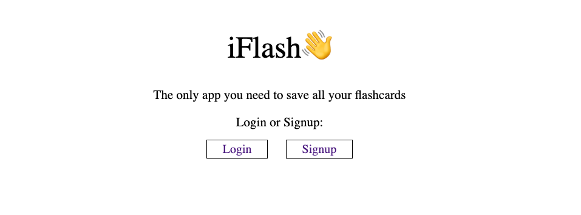
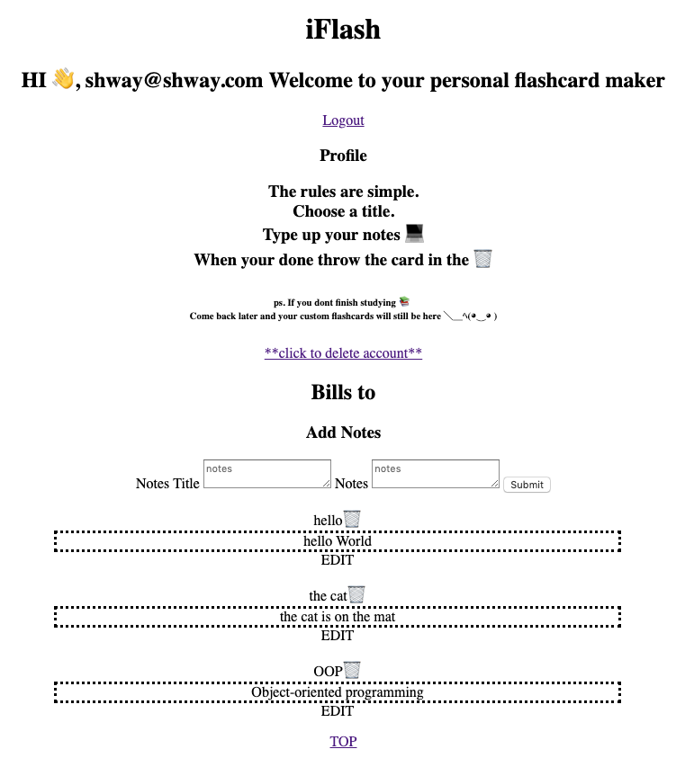

#  ✏️ Roulette-App

### This application allows user to log in under their individual accounts and save their flash cards under their email.  They can then enter anytime in the future and study their cards.

### While in their account they can create headers for their notes and content. They can easily click on the cards to flip them over.  When they have finished studying just simply click on the trash can to throw the card away.

## Tech Used:
- HTML5
- CSS3
- Javascript
- Node.js
- Express
- Mongo DB
- say.js

## Installation

1. Clone repo
2. run `npm install`

## Usage

1. run `node server.js`
2. Navigate to `localhost:3000`
3. Have fun ;)

## Credit

Modified from Scotch.io's auth tutorial
